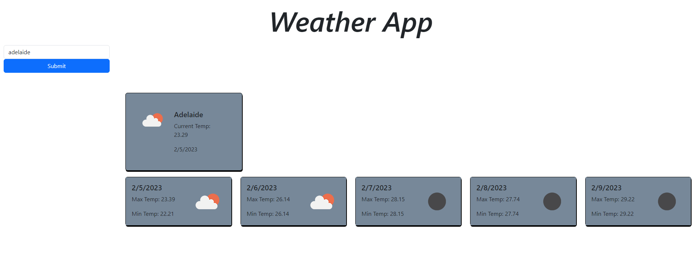

# Weather App
## Description
The purpose of this Weather App is to allow the user to search up any
 given city and be displayed with the current weather and five day forecast.

## Usage
Type in a city to the search box on the right of the screen and click submit,
 the grey boxes will be displayed with the temps for that day alongside the weather 'icon' and date.

## Links
Live page - https://zim40.github.io/WeatherApp/

## Licence
MIT Licence.